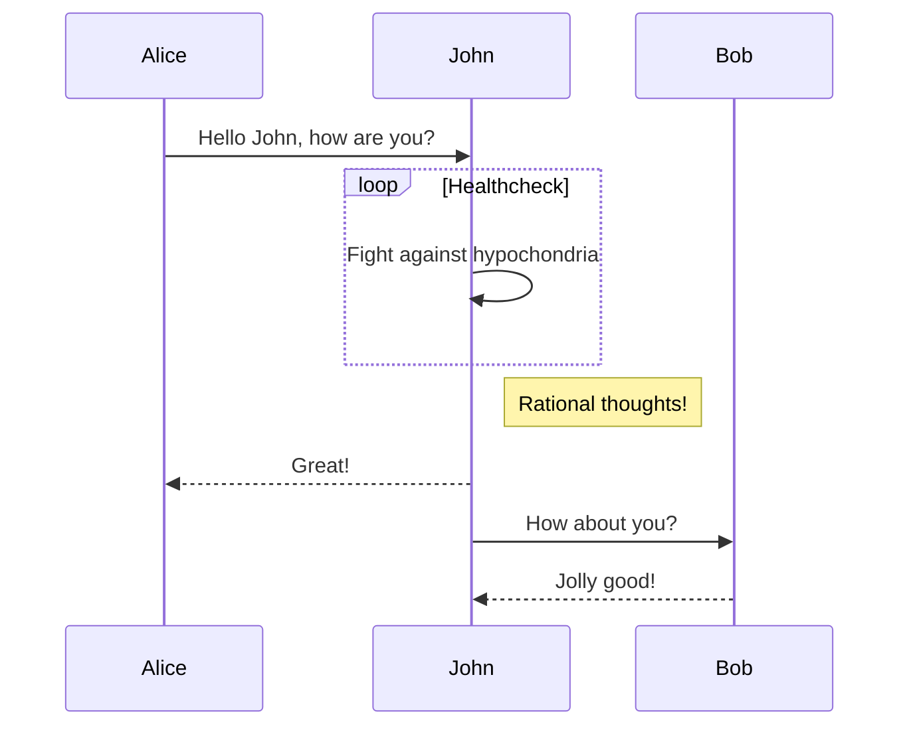

```markdown
## 标题2
### 标题3
#### 标题4
##### 标题5
```

## 标题2
### 标题3
#### 标题4
##### 标题5

---
文本样式

```markdown
**加粗**  __斜体__  _斜体_  *斜体*  ~~划线~~  ~划线~ <u>下划线</u>
> 引用文本
上标<sup>2</sup>
下标<sub>2</sub>
```

**加粗**  __斜体__  _斜体_  *斜体*  ~~划线~~  ~划线~
> 引用文本

<u>下划线</u>

上标<sup>2</sup>
下标<sub>2</sub>

---
列表样式：

```markdown
* 列表
* 列表
* 列表

- 列表
- 列表
- 列表
 
+ 列表
+ 列表
+ 列表
```

* 列表
* 列表
* 列表
- 列表
- 列表
- 列表
+ 列表
+ 列表
+ 列表

```markdown
- 项目
  * 项目
    + 项目

1. 项目1
2. 项目2
3. 项目3

- [ ] 计划任务
- [x] 完成任务
```

- 项目
  * 项目
    + 项目

1. 项目1
2. 项目2
3. 项目3

- [ ] 计划任务
- [x] 完成任务

---
链接和图片：
[link-delicate](http://localhost:4000/delicate)


---
内联代码块:`code`

代码块：

```
var foo = 'bar';
```

```javascript
// An highlighted block
var foo = 'bar';
```

---
表格：

表格与上下文字需要隔一行。

| Column 1 | Column 2      |
|:--------:| -------------:|
| centered 文本居中 | right-aligned 文本居右 |
| centered 文本居中 | right-aligned 文本居右 |
| centered 文本居中 | right-aligned 文本居右 |
| centered 文本居中 | right-aligned 文本居右 |
---
代码里的code颜色
> 常用于记录代码或文字的更替

```diff
+ this will be highlighted in green
- this will be highlighted in red
```

----
## MathJax
需要 front-matter 添加 `mathjax: true`;
包含在 $ 内的文字会被解析为数学公式。

mathjax语法百度一下即可，这方面的文章很多，尤其是CSDN。

### 行内公式

```mathjax
$\cos 2\theta = \cos^2 \theta - \sin^2 \theta = 2 \cos^2 \theta$
```

$\cos 2\theta = \cos^2 \theta - \sin^2 \theta = 2 \cos^2 \theta$

### 行间公式

```mathjax
$$ x = \dfrac{-b \pm \sqrt{b^2 - 4ac}}{2a} $$
```

$$ x = \dfrac{-b \pm \sqrt{b^2 - 4ac}}{2a} $$

有公式才加载MathJax，没有公式仍然加载js渲染公式，会影响页面加载速度。

## mermaid

首先：安装插件：
```bash
npm install hexo-filter-mermaid-diagrams
# or yarn
yarn add hexo-filter-mermaid-diagrams
```

在文章的 Front-matter 中添加 `mermaid: true` , 开启 mermaid。

```markdown
----mermaid # 使用时将 - 替换为 ` ，这里是为了避免被渲染。
sequenceDiagram
Alice->>John: Hello John, how are you?
loop Healthcheck
    John->>John: Fight against hypochondria
end
Note right of John: Rational thoughts!
John-->>Alice: Great!
John->>Bob: How about you?
Bob-->>John: Jolly good!
---
```



更多mermaid语法参考：
- [hexo-filter-mermaid-diagrams](https://github.com/webappdevelp/hexo-filter-mermaid-diagrams)
- [mermaid-js/mermaid](https://github.com/mermaid-js/mermaid)


